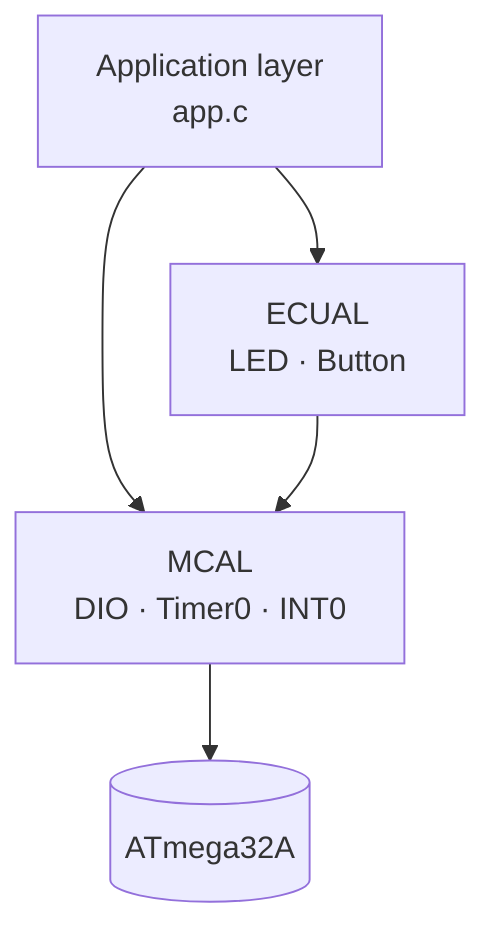

# 🚦 On-Demand Pedestrian Traffic Light (ATmega32A)


A bare-metal **pedestrian crossing controller** for the AVR **ATmega32A**. Cars and pedestrians each have their own red/yellow/green signals, and a push button lets a pedestrian request a crossing at any time.

Everything is written from scratch in C with **no Arduino or vendor libraries**: direct register access, a hand-built timer delay, and an external interrupt, organized in a layered architecture.

---

## ✨ Features

- **Normal mode:** an endless car/pedestrian signal cycle with 5-second phases
- **Pedestrian mode:** the button press is caught by an external interrupt (INT0) and the controller runs a crossing sequence, then returns to normal mode
- **Blinking yellow** phases for both car and pedestrian lights
- **Timer0-based delay** driver (prescaler 1024) with no busy `for`-loop counting
- A **unit-test file for every driver** (`DIO`, `Timer`, `Interrupt`, `LED`, `Button`)

## 🧱 Layered architecture

```
GccApplication1/
├── main.c
├── app/            app.c / app.h         → traffic-light state logic
├── ECUAL/          (hardware abstraction)
│   ├── LED/        LED.c / LED.h / LED_test.c
│   └── Button/     Button.c / Button.h / Button_test.c
├── MCAL/           (microcontroller drivers)
│   ├── DIO/        DIO_function.c / DIO_INTERFACE.h / DIO_REG.h / DIO_test.c
│   ├── Timer/      Timer.c / Timer.h / Timer_REG.h / timer_test.c
│   └── Interrupt/  interrupts.c / interrupts.h / interrupts_Reg.h / test_interrupt.c
└── Lib/            STD_TYPES.h / BIT_MATH.h
```



Each layer only talks to the one below it, so swapping the LED or button for a different part, or porting to another MCU, only touches the lower layers.

## 🔌 Hardware

| Signal | Port | Pin |
|---|---|---|
| Car 🟢 Green | PORTA | 0 |
| Car 🟡 Yellow | PORTA | 1 |
| Car 🔴 Red | PORTA | 2 |
| Pedestrian 🟢 Green | PORTB | 0 |
| Pedestrian 🟡 Yellow | PORTB | 1 |
| Pedestrian 🔴 Red | PORTB | 2 |
| Crossing request button | PORTD | 2 (INT0, rising edge) |

**MCU:** ATmega32A · **Clock:** 8 MHz (the Timer0 math assumes this)

## 🔄 How it works

### Normal mode

| Phase | Car lights | Pedestrian lights | Duration |
|---|---|---|---|
| 1 | 🟢 Green | 🔴 Red | 5 s |
| 2 | 🟡 Blinking | 🟡 Blinking | 5 s |
| 3 | 🔴 Red | 🟢 Green | 5 s |
| 4 | 🟡 Blinking | 🟡 Blinking | 5 s |

The cycle then repeats.

### Pedestrian mode

1. Pressing the button triggers **INT0** on a rising edge. The ISR only sets a flag, which keeps the interrupt handler short.
2. At the end of the current phase, the main loop sees the flag and switches into the pedestrian sequence for the state the cars were in (green, yellow, or red).
3. The sequence gives pedestrians a green window with cars held at red, surrounded by yellow-blink transitions.
4. The flag is cleared and the controller returns to normal mode.

## ⏱️ Timer driver

`delay(ms)` is built on **Timer0 in normal mode** with a 1024 prescaler. At 8 MHz, one timer tick is 0.128 ms and a full 8-bit overflow takes 32.768 ms. For longer delays the driver calculates the number of overflows and the preload value and polls the overflow flag, so delays of any length are produced without hard-coded loop counts.

## 🚀 Getting started

**Requirements:** Microchip Studio (formerly Atmel Studio 7) and an ATmega32A, or a simulator such as Proteus.

1. Clone the repository
2. Open `FWD_ON_DEMAND_TRAFFIC_LIGHT.atsln` in Microchip Studio
3. Build the solution (**F7**)
4. Flash the generated `Debug/project.hex` to the chip, or load it into your simulator
5. Wire the LEDs and the button as shown in the pin table above

## 🧠 What I practiced

- Direct register-level programming of GPIO, Timer0 and external interrupts
- Layered embedded architecture (MCAL / ECUAL / App)
- Writing an ISR and sharing state with the main loop safely
- Building reusable drivers with a separate test file per driver
- Designing a simple state-driven controller

## 🔭 Possible improvements

- Replace the polling-based `delay()` with a timer-interrupt tick so the button reacts immediately instead of at the end of a phase
- Remove the recursive `Normal()` / `pedestrian()` calls in favor of a state variable
- Mark the shared interrupt flag `volatile`
- Add button debouncing

## 👤 Author

**Mohamed Salah** — [GitHub](https://github.com/YOUR_USERNAME) · [LinkedIn](https://linkedin.com/in/YOUR_PROFILE)
