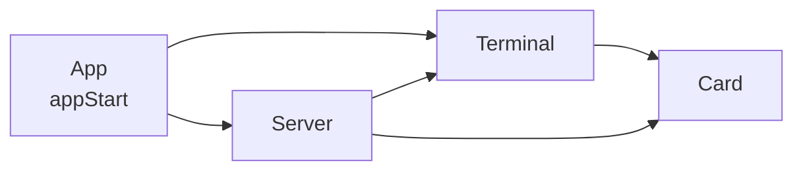
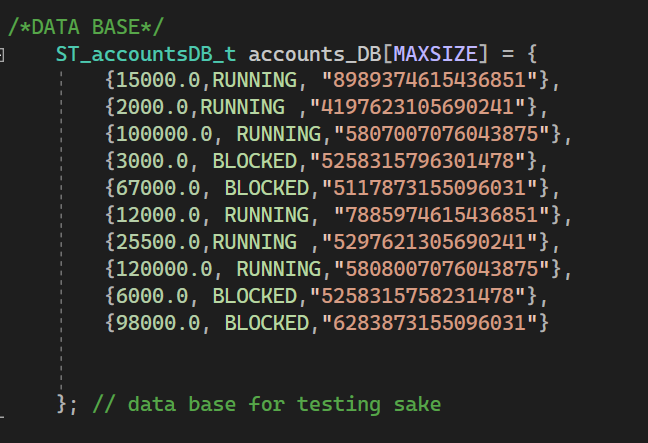
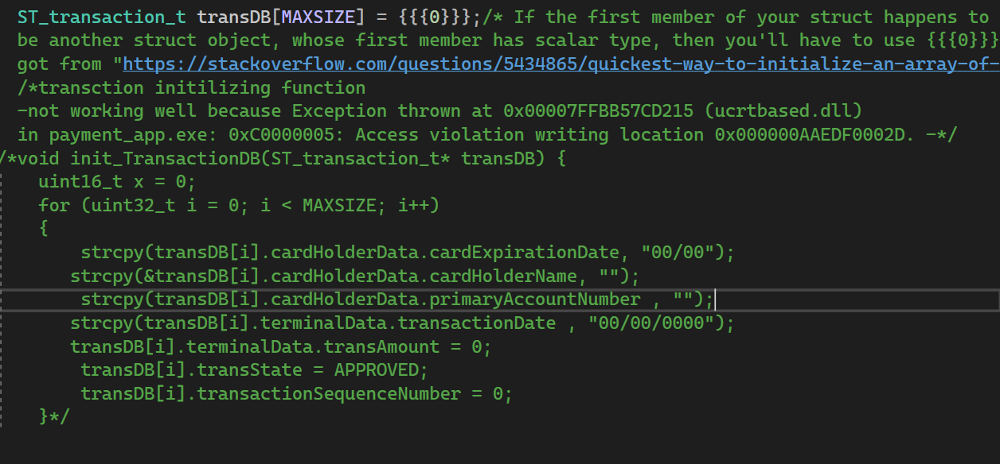

# 💳 Payment Application (C)


A console-based **card payment simulator** written in C. It models the full path of a card transaction: a **terminal** collects the card and amount, the **server** validates the account and balance, and the result is approved or declined and stored in a transaction database.

Built as a project in the Udacity (FWD) embedded systems course, with a strong focus on **modular design, clean module interfaces, and testing against user stories**.

---

## ✨ Features

- Card data entry with validation (holder name, expiry date, PAN)
- Terminal checks: transaction date (read from the system clock), card expiry, amount validity, and a configurable maximum transaction amount (default **5000**)
- Server checks: account lookup, blocked-account detection, balance check
- In-memory **accounts database** and **transaction database**
- Retrieve any saved transaction by its sequence number
- Process multiple transactions in one session

## 🧱 Architecture

The project is split into four modules, each with its own header (interface) and source file:

```
payment_app/
├── App/        app.c / app.h            → application flow (appStart)
├── Card/       card.c / card.h          → card holder name, expiry date, PAN
├── Terminal/   Terminal.c / Terminal.h  → date, expiry check, amount, max amount
├── Server/     Server.c / Server.h      → accounts DB, validation, transaction DB
└── Lib/        std_types.h              → fixed-width standard types
```



Every function returns a module-specific **error enum** (`EN_cardError_t`, `EN_terminalError_t`, `EN_serverError_t`, `EN_transState_t`) instead of printing or exiting, which keeps the modules independent and easy to test.


## 🔄 Transaction flow

1. **Terminal** reads the current date and sets the max amount.
2. **Card** module collects the holder name, expiry date (`MM/YY`) and PAN.
3. **Terminal** collects the transaction amount.
4. **Server** runs the checks in order and either declines or approves:

| Check | Decline result |
|---|---|
| PAN not found in accounts DB | `DECLINED_FRAUD_CARD` |
| Account is blocked | `DECLINED_STOLEN_CARD` |
| Amount greater than balance | `DECLINED_INSUFFECIENT_FUND` |
| Amount greater than terminal max | `DECLINED_EXCEED_MAX_AMOUNT` |
| Card expired | `EXPIRED_CARD` |
| All checks pass | `APPROVED_TRANSACTION` — balance is updated |

### Input rules

| Field | Rule |
|---|---|
| Card holder name | 20–24 characters |
| Expiry date | `MM/YY` format |
| PAN | 16–19 characters |
| Amount | greater than 0 and not above the terminal max |

## 🚀 Getting started

**Requirements:** Windows, Visual Studio 2022 (MSVC toolset v143) with the *Desktop development with C++* workload.

1. Clone the repository
2. Open `payment_app.sln`
3. Select **x64 / Debug** and press **F5**

### Try it with the seeded accounts

The accounts database ships with 10 test accounts. A few to play with:

| PAN | Balance | State |
|---|---|---|
| `8989374615436851` | 15000 | Running |
| `4197623105690241` | 2000 | Running |
| `5807007076043875` | 100000 | Running |
| `5258315796301478` | 3000 | **Blocked** |

Use any 20–24 character name, a future expiry like `12/30`, and one of the PANs above. A PAN that isn't in the table triggers the fraud-card path.

## 🎬 Demos & test cases

Each function was tested and recorded individually, plus one recording per user story.

**User stories**

- [Transaction approved](videos/TEST%20CASES_user%20stories/Transaction%20approved%20user%20story.mp4)
- [Expired card](videos/TEST%20CASES_user%20stories/Expired%20card%20user%20story.mp4)
- [Invalid card](videos/TEST%20CASES_user%20stories/Invalid%20card%20user%20story.mp4)
- [Insufficient funds](videos/TEST%20CASES_user%20stories/Insufficient%20fund%20user%20story.mp4)
- [Exceeds the maximum amount](videos/TEST%20CASES_user%20stories/Exceed%20the%20maximum%20amount%20user%20story.mp4)

**Per-function walkthroughs**

- [Card module](videos/Card%20module/) — `getCardHolderName`, `getCardExpiryDate`, `getCardPAN`
- [Terminal module](videos/Terminal%20module/) — `getTransactionDate`, `isCardExpired`, `getTransactionAmount`, `setMaxAmount`, `isBelowMaxAmount`
- [Server module](videos/Server%20module/) — `recieveTransactionData`, `isValidAccount`, `isBlockedAccount`, `isAmountAvailable`, `saveTransaction`, `getTransaction`
- [App module](videos/app%20module/) — `appStart`

## 🖼️ Screenshots

| Accounts database | Transaction database |
|---|---|
|  |  |

## 🧠 What I practiced

- Splitting a program into modules with clear header-file interfaces
- Defining structs and enums to model real-world data (cards, terminals, accounts, transactions)
- Error handling through return codes
- Input validation and string handling in C
- Writing test cases from user stories and verifying each function in isolation

## 🔭 Possible improvements

- Replace `gets()` with `fgets()` for safe input handling
- Add the Luhn checksum to PAN validation
- Persist the accounts and transaction databases to a file
- Add automated unit tests alongside the recorded manual ones

## 👤 Author

**Mohamed Salah** — [GitHub](https://github.com/YOUR_USERNAME) · [LinkedIn](https://linkedin.com/in/YOUR_PROFILE)
